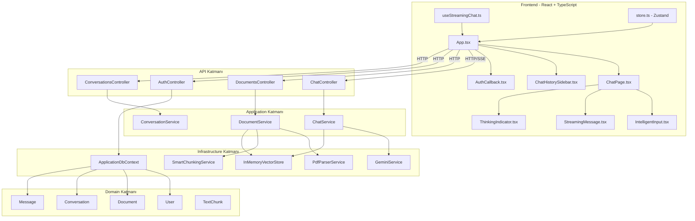
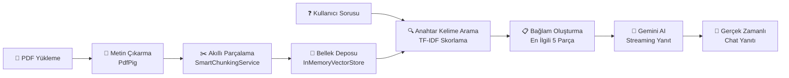
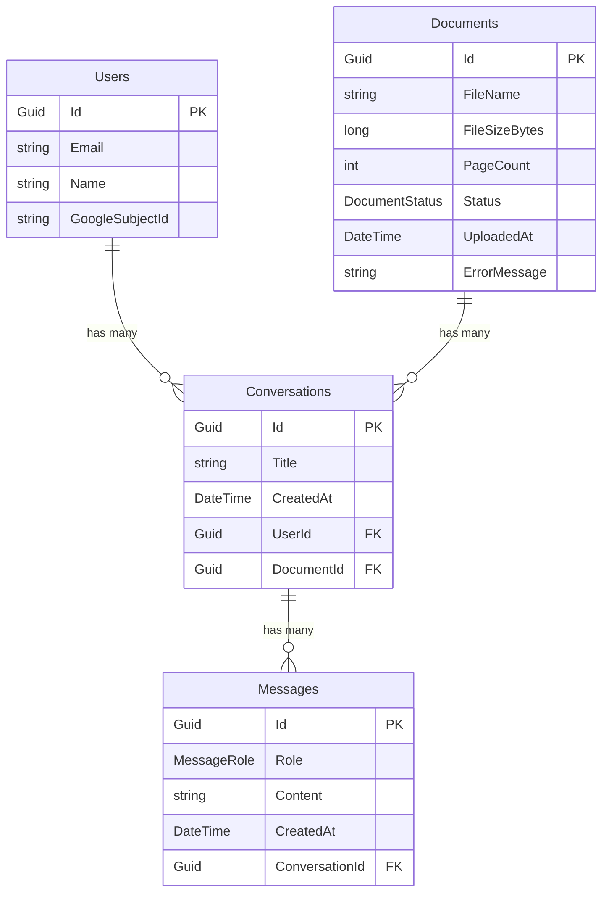
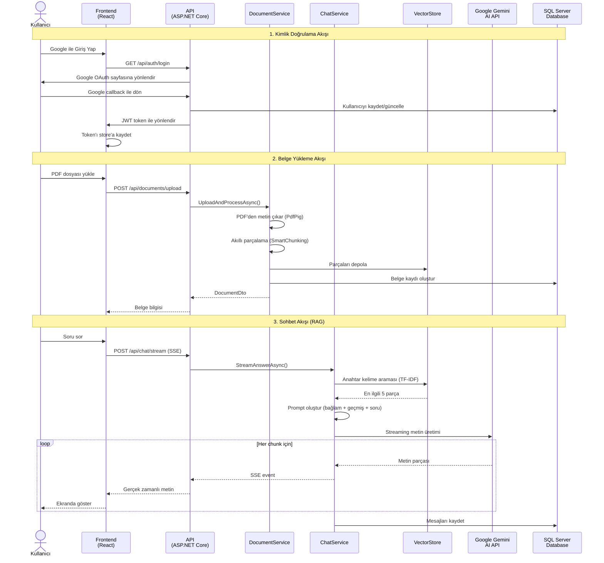

# AnalyzeChat — Proje Dokümanı (Vize Dönemi Raporu)

**Proje Adı:** AnalyzeChat  
**Tarih:** 11 Nisan 2026  
**Hazırlayan:** Proje Geliştirici  

---

## 📋 İçindekiler

1. [Projenin Amacı](#1-projenin-amacı)
2. [Projede Kullanılan Teknolojiler](#2-projede-kullanılan-teknolojiler)
3. [Projenin Benzer Projelerden Üstünlüğü](#3-projenin-benzer-projelerden-üstünlüğü)
4. [Yazılımsal Olarak Mevcut Aşama — Detaylı Doküman](#4-yazılımsal-olarak-mevcut-aşama--detaylı-doküman)

---

## 1. Projenin Amacı

### 1.1 Genel Amaç

**AnalyzeChat**, kullanıcıların PDF belgelerini yükleyerek yapay zekâ destekli sohbet (chat) arayüzü üzerinden belgeler hakkında soru sorabilmelerini, özetleme yapabilmelerini ve bilgi çıkarabilmelerini sağlayan akıllı bir belge analiz platformudur.

### 1.2 Problemin Tanımı

Günümüzde akademik makaleler, raporlar, hukuki belgeler ve teknik dokümanlar gibi uzun ve karmaşık PDF dosyaları üzerinde bilgi aramak oldukça zaman alıcıdır. Kullanıcılar genellikle:

- Sayfalarca dokümanı elle okuyarak aradıkları bilgiyi bulmak zorunda kalır.
- Farklı bölümler arasında ilişki kurmakta zorlanır.
- Belgelerin özetlenmesi için harici araçlar kullanır.
- Belirli bir konuyu belge içinden çıkarmak için tekrar tekrar okuma ihtiyacı duyar.

### 1.3 Çözüm Yaklaşımı

AnalyzeChat, **RAG (Retrieval-Augmented Generation)** mimarisini kullanarak bu sorunlara çözüm sunar:

1. **Belge Yükleme:** Kullanıcı bir PDF dosyasını sisteme yükler.
2. **Metin Çıkarma:** PDF'den sayfa sayfa metin çıkarılır.
3. **Akıllı Parçalama (Smart Chunking):** Çıkarılan metin, anlamsal bütünlüğü koruyacak şekilde parçalara ayrılır.
4. **Bağlam Arama:** Kullanıcının sorusu ile en ilgili parçalar TF-IDF tabanlı anahtar kelime araması ile bulunur.
5. **Yapay Zekâ Yanıtı:** Bulunan bağlam, sohbet geçmişi ve kullanıcının sorusu birleştirilerek Google Gemini AI modeline gönderilir.
6. **Akış Yanıtı (Streaming):** AI yanıtı gerçek zamanlı olarak kullanıcıya iletilir.

### 1.4 Hedef Kitle

- Akademisyenler ve araştırmacılar
- Öğrenciler
- Avukatlar ve hukuk çalışanları
- İş dünyasında rapor okuyucuları
- Teknik doküman okuyucuları

---

## 2. Projede Kullanılan Teknolojiler

### 2.1 Backend (Sunucu Tarafı)

| Teknoloji | Versiyon | Kullanım Amacı |
|---|---|---|
| **ASP.NET Core** | .NET 8+ | Web API framework, RESTful API geliştirme |
| **Entity Framework Core** | 8+ | ORM (Nesne-İlişki Eşleme), veritabanı işlemleri |
| **SQL Server** | — | İlişkisel veritabanı (kullanıcılar, belgeler, sohbetler, mesajlar) |
| **Google Gemini API** | v1beta | Yapay zekâ metin üretimi (LLM) ve embedding oluşturma |
| **PdfPig (UglyToad.PdfPig)** | — | PDF dosyalarından metin çıkarma |
| **JWT (JSON Web Token)** | — | Kimlik doğrulama ve yetkilendirme token'ları |
| **Google OAuth 2.0** | — | Google ile sosyal giriş (3. taraf kimlik doğrulama) |
| **Swagger / OpenAPI** | — | API dokümantasyonu ve test arayüzü |

### 2.2 Frontend (İstemci Tarafı)

| Teknoloji | Versiyon | Kullanım Amacı |
|---|---|---|
| **React** | 19.2 | Kullanıcı arayüzü bileşen kütüphanesi |
| **TypeScript** | 5.9 | Tip güvenli JavaScript geliştirme |
| **Vite** | 7.3 | Hızlı geliştirme sunucusu ve derleme aracı |
| **Zustand** | 5.0 | Hafif global durum yönetimi |
| **Framer Motion** | 12.34 | Akıcı animasyonlar ve geçiş efektleri |
| **React Markdown** | 10.1 | Markdown içeriğin HTML olarak render edilmesi |
| **React Dropzone** | 15.0 | Dosya sürükle-bırak yükleme |
| **React PDF** | 10.3 | PDF dosyası önizleme |
| **React Router DOM** | 7.13 | Sayfa yönlendirme (routing) |
| **Remark GFM** | 4.0 | GitHub Flavored Markdown desteği |

### 2.3 Mimari Yapı

Proje, **Clean Architecture (Temiz Mimari)** prensiplerini uygulayan 4 katmanlı bir yapıya sahiptir:

```
Analyzcaht/
├── src/
│   ├── AnalyzeChat.Domain/          → Entities & Enums (İş Kuralları)
│   ├── AnalyzeChat.Application/     → Services, Interfaces, DTOs (Uygulama Katmanı)
│   ├── AnalyzeChat.Infrastructure/  → Data, Services (Altyapı Katmanı)
│   └── AnalyzeChat.API/             → Controllers, Program.cs (Sunum Katmanı)
└── frontend/                        → React + TypeScript (Kullanıcı Arayüzü)
```



### 2.4 Yapay Zekâ Boru Hattı (RAG Pipeline)



---

## 3. Projenin Benzer Projelerden Üstünlüğü

### 3.1 Benzer Projeler ile Karşılaştırma

| Özellik | ChatPDF | PDF.ai | AnalyzeChat (Bizim Proje) |
|---|---|---|---|
| PDF metin çıkarma | ✅ | ✅ | ✅ |
| AI ile sohbet | ✅ | ✅ | ✅ |
| Streaming (gerçek zamanlı) yanıt | ❌ | ✅ | ✅ |
| Türkçe dil desteği (UI + AI prompt) | ❌ | ❌ | ✅ |
| Model seçimi (birden fazla AI model) | ❌ | ❌ | ✅ (Gemini 2.5 Flash, Pro, 2.0 Flash, Lite) |
| Google OAuth ile giriş | ❌ | ✅ | ✅ |
| Sohbet geçmişi saklama | ❌ | ✅ | ✅ (Veritabanında kalıcı) |
| Açık kaynak / özelleştirilebilir | ❌ | ❌ | ✅ |
| Clean Architecture | — | — | ✅ |
| Ücretsiz kullanım | Sınırlı | Sınırlı | ✅ (Kendi API anahtarı ile) |

### 3.2 AnalyzeChat'in Ayırt Edici Üstünlükleri

#### 🇹🇷 3.2.1 Tam Türkçe Dil Desteği
- Tüm kullanıcı arayüzü Türkçe olarak tasarlanmıştır.
- AI prompt'ları Türkçe olarak hazırlanmıştır, bu sayede yanıtlar da Türkçe olarak döner.
- Hata mesajları, bildirimler ve tüm kullanıcı etkileşimleri Türkçe'dir.

#### 🤖 3.2.2 Çoklu Model Desteği
Kullanıcılar ihtiyaçlarına göre 4 farklı Gemini AI modeli arasında seçim yapabilir:
- **Gemini 2.5 Flash** — Hızlı ve güncel
- **Gemini 2.5 Pro** — Daha detaylı ve kapsamlı yanıtlar
- **Gemini 2.0 Flash** — Dengeli performans
- **Gemini 2.0 Flash Lite** — En hızlı, düşük kaynak tüketimi

#### ⚡ 3.2.3 Gerçek Zamanlı Akış Yanıtı (SSE Streaming)
- AI yanıtları **Server-Sent Events (SSE)** teknolojisi ile gerçek zamanlı olarak kullanıcıya iletilir.
- Kullanıcı, yanıtın tamamlanmasını beklemek zorunda kalmaz; her kelime anında ekranda görünür.
- "Düşünme" göstergesi (ThinkingIndicator) ile kullanıcı deneyimi iyileştirilmiştir.

#### 🏗️ 3.2.4 Temiz Mimari (Clean Architecture)
- Proje, endüstri standardı olan **Clean Architecture** prensiplerini uygular.
- Domain, Application, Infrastructure ve API katmanları birbirinden bağımsızdır.
- Bu sayede bakım, test ve genişletme kolaylığı sağlanır.

#### 🔍 3.2.5 Akıllı Metin Parçalama (Smart Chunking)
- Metinler, anlamsal bütünlüğü koruyacak şekilde paragraf ve başlık bazlı parçalanır.
- Parçalar arası **overlap (örtüşme)** ile bağlam kaybı önlenir.
- TF-IDF tabanlı arama ile en ilgili parçalar bulunur.

#### 🔐 3.2.6 Güvenli Kimlik Doğrulama
- **Google OAuth 2.0** ile güvenli sosyal giriş.
- **JWT (JSON Web Token)** tabanlı oturum yönetimi.
- Kullanıcı bilgileri veritabanında güvenli şekilde saklanır.

#### 💬 3.2.7 Sohbet Geçmişi Yönetimi
- Tüm sohbetler ve mesajlar veritabanında kalıcı olarak saklanır.
- Kullanıcılar önceki sohbetlerine geri dönebilir.
- Kenar çubuğu (sidebar) ile sohbet geçmişi görsel olarak yönetilir.

#### 🎨 3.2.8 Modern ve Dinamik Kullanıcı Arayüzü
- **Framer Motion** ile akıcı animasyonlar.
- **Markdown render** desteği ile zengin formatlanmış AI yanıtları.
- Responsive tasarım ile mobil ve masaüstü uyumu.
- Dosya sürükle-bırak desteği.

---

## 4. Yazılımsal Olarak Mevcut Aşama — Detaylı Doküman

### 4.1 Proje Durumu Özeti

| Modül | Durum | Tamamlanma |
|---|---|---|
| Domain Katmanı (Entities & Enums) | ✅ Tamamlandı | %100 |
| Application Katmanı (Services, Interfaces, DTOs) | ✅ Tamamlandı | %100 |
| Infrastructure Katmanı (Data, Services) | ✅ Tamamlandı | %95 |
| API Katmanı (Controllers, Program.cs) | ✅ Tamamlandı | %100 |
| Frontend (React + TypeScript) | ✅ Tamamlandı | %90 |
| Google OAuth Kimlik Doğrulama | ✅ Tamamlandı | %100 |
| Veritabanı (SQL Server + Migrations) | ✅ Tamamlandı | %100 |
| AI Entegrasyonu (Gemini API) | ✅ Tamamlandı | %100 |

---

### 4.2 Backend — Detaylı Aşama Analizi

#### 4.2.1 Domain Katmanı (`AnalyzeChat.Domain`)

**Durum:** ✅ Tamamlandı

Tüm domain varlıkları (entities) ve numaralandırmalar (enums) tanımlanmıştır:

**Entities (Varlıklar):**

| Entity | Dosya | Açıklama |
|---|---|---|
| `User` | `User.cs` | Kullanıcı bilgileri (Id, Email, Name, GoogleSubjectId) |
| `Document` | `Document.cs` | Yüklenen PDF belgeleri (FileName, FileSize, PageCount, Status) |
| `Conversation` | `Conversation.cs` | Sohbet oturumları (Title, UserId, DocumentId) |
| `Message` | `Message.cs` | Sohbet mesajları (Role, Content, ConversationId) |
| `TextChunk` | `TextChunk.cs` | Metin parçaları (Content, PageNumber, ChunkIndex, Embedding) |
| `ChatSession` | `ChatSession.cs` | Sohbet oturum yönetimi |
| `ChatMessage` | `ChatMessage.cs` | Sohbet mesaj modeli |

**Enums (Numaralandırmalar):**

| Enum | Değerler | Açıklama |
|---|---|---|
| `DocumentStatus` | Uploading, Processing, Ready, Failed | Belge işleme durumu |
| `MessageRole` | User, Assistant | Mesaj gönderen rolü |

#### 4.2.2 Application Katmanı (`AnalyzeChat.Application`)

**Durum:** ✅ Tamamlandı

**Servisler:**

| Servis | Dosya | Sorumluluk |
|---|---|---|
| `ChatService` | `ChatService.cs` | RAG pipeline orkestrasyonu: anahtar kelime araması → prompt oluşturma → AI'dan streaming yanıt alma |
| `DocumentService` | `DocumentService.cs` | Belge yükleme, PDF ayrıştırma, akıllı parçalama ve depolama |
| `ConversationService` | `ConversationService.cs` | Sohbet oturumlarının CRUD işlemleri |

**Arayüzler (Interfaces):**

| Interface | Dosya | Açıklama |
|---|---|---|
| `IApplicationDbContext` | `IApplicationDbContext.cs` | Veritabanı bağlam soyutlaması |
| `IChatAIService` | `IChatAIService.cs` | AI servisi soyutlaması (streaming + embedding) |
| `IChunkingService` | `IChunkingService.cs` | Metin parçalama soyutlaması |
| `IPdfService` | `IPdfService.cs` | PDF metin çıkarma soyutlaması |
| `IVectorStore` | `IVectorStore.cs` | Vektör deposu soyutlaması (arama + depolama) |

**DTOs (Veri Transfer Nesneleri):**

| DTO | Dosya | Açıklama |
|---|---|---|
| `ChatRequest` | `ChatRequest.cs` | Sohbet isteği modeli (Message, DocumentId, ConversationId, History, SelectedModel) |
| `DocumentDto` | `DocumentDto.cs` | Belge yanıt modeli |

#### 4.2.3 Infrastructure Katmanı (`AnalyzeChat.Infrastructure`)

**Durum:** ✅ Tamamlandı (%95)

**Servisler:**

| Servis | Dosya | Açıklama | Durum |
|---|---|---|---|
| `GeminiService` | `GeminiService.cs` | Google Gemini API ile SSE streaming metin üretimi ve embedding oluşturma. Hız sınırlaması (rate limiting) için üstel geri çekilme (exponential backoff) mantığı içerir. | ✅ Tamamlandı |
| `PdfParserService` | `PdfParserService.cs` | PdfPig kütüphanesi ile PDF'den sayfa sayfa metin çıkarma. | ✅ Tamamlandı |
| `SmartChunkingService` | `SmartChunkingService.cs` | Metni paragraf ve başlık bazlı akıllı parçalama. 500 kelimelik parçalar, 50 kelimelik overlap. | ✅ Tamamlandı |
| `InMemoryVectorStore` | `InMemoryVectorStore.cs` | Bellekte TF-IDF tabanlı anahtar kelime araması ve kosinüs benzerliği ile vektör araması. | ✅ Tamamlandı |

**Veri Erişim Katmanı:**

| Bileşen | Dosya | Açıklama |
|---|---|---|
| `ApplicationDbContext` | `ApplicationDbContext.cs` | Entity Framework Core DbContext. Users, Conversations, Messages, Documents tablolarını yönetir. İlişki yapılandırmaları (Cascade Delete, Restrict) tanımlıdır. |

> [!NOTE]
> **Embedding özelliği şu anda devre dışıdır.** API anahtarı `text-embedding-004` modelini desteklemediği için embedding üretimi kodda yorum satırına alınmıştır. Bunun yerine TF-IDF tabanlı anahtar kelime araması kullanılmaktadır. Bu özellik, uygun API anahtarı sağlandığında kolaylıkla etkinleştirilebilir.

#### 4.2.4 API Katmanı (`AnalyzeChat.API`)

**Durum:** ✅ Tamamlandı

**Controllers:**

| Controller | Dosya | Endpoint'ler | Açıklama |
|---|---|---|---|
| `AuthController` | `AuthController.cs` | `GET /api/auth/login`, `GET /api/auth/callback` | Google OAuth 2.0 ile giriş, JWT token üretimi |
| `ChatController` | `ChatController.cs` | `POST /api/chat/stream` | SSE streaming ile AI sohbet yanıtı |
| `DocumentsController` | `DocumentsController.cs` | `POST /api/documents/upload`, `GET /api/documents/{id}` | PDF yükleme ve belge bilgisi sorgulama |
| `ConversationsController` | `ConversationsController.cs` | `GET /api/conversations`, `GET /api/conversations/{id}/messages` | Sohbet geçmişi ve mesaj listeleme |

**Program.cs Yapılandırması:**
- ✅ Database Context (SQL Server + EF Core)
- ✅ CORS yapılandırması
- ✅ JWT + Google OAuth Authentication
- ✅ Swagger / OpenAPI
- ✅ HttpClient (Gemini API için 5 dakika timeout)
- ✅ Dependency Injection (tüm servisler kayıtlı)
- ✅ Middleware Pipeline (CORS → Auth → Controllers)

---

### 4.3 Frontend — Detaylı Aşama Analizi

**Durum:** ✅ Tamamlandı (%90)

#### 4.3.1 Bileşen (Component) Yapısı

| Bileşen | Dosya | Açıklama | Durum |
|---|---|---|---|
| `App` | `App.tsx` | Ana uygulama bileşeni. Routing, state yönetimi, dosya yükleme, sohbet yönetimi. | ✅ Tamamlandı |
| `ChatPage` | `ChatPage.tsx` | Sohbet sayfası. Hoş geldin ekranı, mesaj listesi, model seçici. | ✅ Tamamlandı |
| `IntelligentInput` | `IntelligentInput.tsx` | Akıllı giriş alanı. Otomatik boyutlandırma, dosya eki, gönder butonu. | ✅ Tamamlandı |
| `StreamingMessage` | `StreamingMessage.tsx` | Streaming mesajların Markdown olarak render edilmesi. | ✅ Tamamlandı |
| `ThinkingIndicator` | `ThinkingIndicator.tsx` | AI düşünme animasyonu. | ✅ Tamamlandı |
| `ChatHistorySidebar` | `ChatHistorySidebar.tsx` | Sohbet geçmişi kenar çubuğu. Yeni sohbet, geçmiş sohbet seçimi. | ✅ Tamamlandı |
| `AuthCallback` | `AuthCallback.tsx` | Google OAuth callback sayfası. Token'ı URL'den alıp store'a kaydeder. | ✅ Tamamlandı |

#### 4.3.2 Durum Yönetimi (State Management)

| Store | Dosya | İçerik |
|---|---|---|
| `useAuthStore` | `store.ts` | Kullanıcı bilgileri, token, isAuthenticated, login/logout işlemleri |
| `useChatStore` | `store.ts` | Aktif oturum ID, seçili model, oturum yönetimi |

#### 4.3.3 Özel Hook'lar

| Hook | Dosya | Açıklama |
|---|---|---|
| `useStreamingChat` | `useStreamingChat.ts` | SSE streaming ile AI sohbet. Fetch API + ReadableStream. İstek iptali (AbortController) desteği. |

#### 4.3.4 API İstemcisi

| Fonksiyon | Dosya | Açıklama |
|---|---|---|
| `uploadDocument` | `api.ts` | PDF dosyası yükleme |
| `getDocument` | `api.ts` | Belge bilgisi sorgulama |
| `getConversations` | `api.ts` | Sohbet geçmişi listeleme |
| `getConversationMessages` | `api.ts` | Sohbet mesajlarını listeleme |

---

### 4.4 Veritabanı Şeması



---

### 4.5 Tamamlanan Özellikler Özeti

#### ✅ Tamamlanan Özellikler

1. **PDF Belge Yükleme ve İşleme**
   - PDF dosyası yükleme (frontend drag-and-drop + dosya seçici)
   - PDF'den metin çıkarma (PdfPig)
   - Akıllı metin parçalama (Smart Chunking)
   - Bellek tabanlı depolama (InMemoryVectorStore)

2. **AI ile Sohbet (RAG Pipeline)**
   - TF-IDF tabanlı anahtar kelime araması
   - Bağlam oluşturma (en ilgili 5 parça)
   - Google Gemini AI ile streaming metin üretimi
   - Sohbet geçmişi bağlamı (son 5 mesaj)
   - Çoklu model seçimi (4 Gemini model)

3. **Kullanıcı Kimlik Doğrulama**
   - Google OAuth 2.0 sosyal giriş
   - JWT token üretimi ve doğrulama
   - Kullanıcı oturum yönetimi (Zustand store)

4. **Sohbet Geçmişi**
   - Sohbet oturumları oluşturma ve kaydetme
   - Mesajları veritabanında kalıcı saklama
   - Kenar çubuğu ile geçmiş sohbetlere erişim
   - Yeni sohbet başlatma

5. **Kullanıcı Arayüzü**
   - Modern ve responsive tasarım
   - Framer Motion animasyonları
   - Markdown render desteği
   - AI düşünme göstergesi
   - Dosya eki gösterimi
   - Model seçici dropdown

6. **Altyapı**
   - Clean Architecture (4 katman)
   - Entity Framework Core Migrations
   - Swagger API dokümantasyonu
   - CORS yapılandırması
   - Rate limiting ile hata yönetimi (Gemini 429 retry)
   - Loglama (ILogger)

#### 🔧 Geliştirilmesi Planlanan Özellikler

1. **Embedding Tabanlı Arama** — API anahtarı güncellendiğinde vektör tabanlı semantik arama aktifleştirilecek.
2. **Çoklu Dosya Desteği** — Birden fazla PDF ile aynı anda sohbet.
3. **Dosya Önizleme** — PDF dosyasının uygulama içinde görüntülenmesi.
4. **Kullanıcı Profili** — Profil düzenleme ve ayarlar sayfası.
5. **Dışa Aktarma** — Sohbet geçmişini PDF veya Word olarak dışa aktarma.

---

### 4.6 Çalışma Akışı (Flow)



---

### 4.7 Dosya ve Satır Sayısı İstatistikleri

| Katman | Dosya Sayısı | Açıklama |
|---|---|---|
| **Domain** | 9 dosya | 7 Entity + 2 Enum |
| **Application** | 10 dosya | 3 Service + 5 Interface + 2 DTO |
| **Infrastructure** | 5+ dosya | 4 Service + 1 DbContext + Migrations |
| **API** | 6+ dosya | 4 Controller + Program.cs + Config |
| **Frontend** | 10+ dosya | 6 Component + 1 Hook + 1 Store + 1 API + Types |
| **Toplam** | ~40+ dosya | Full-stack uygulama |

---

> [!IMPORTANT]
> **Bu doküman, vize dönemine kadar gerçekleştirilen tüm çalışmaları kapsamaktadır.** Proje, çalışır durumda bir full-stack uygulamadır. Backend API'si, frontend arayüzü, veritabanı entegrasyonu, AI entegrasyonu ve kullanıcı kimlik doğrulama sistemi tamamlanmıştır. Geliştirilmesi planlanan özellikler, final döneminde ele alınacaktır.
